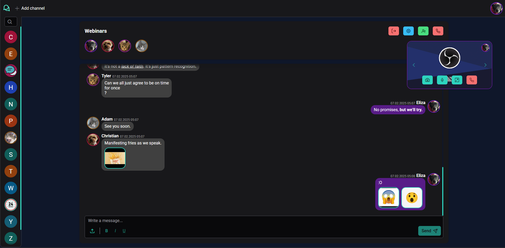
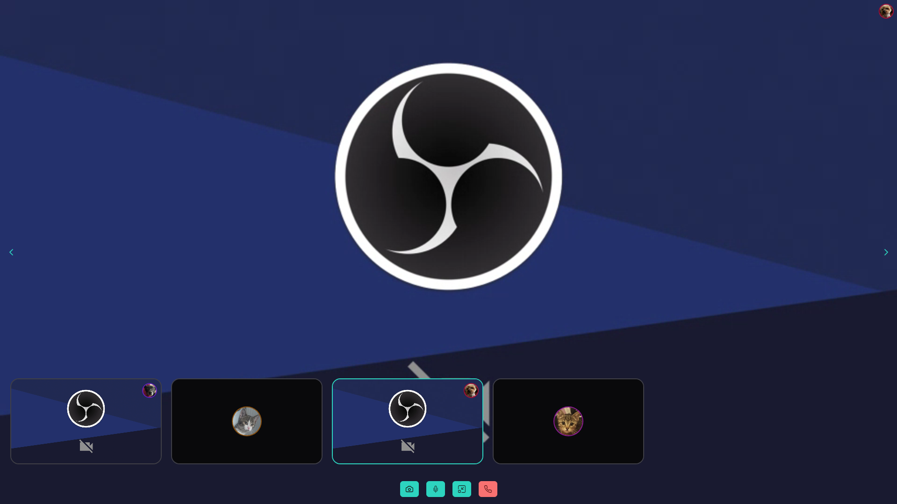
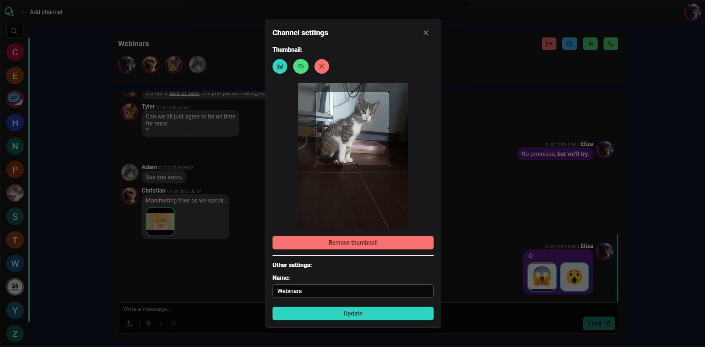
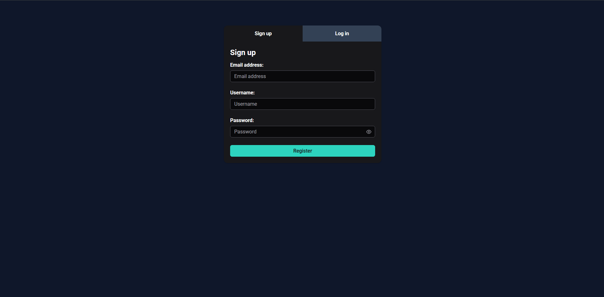
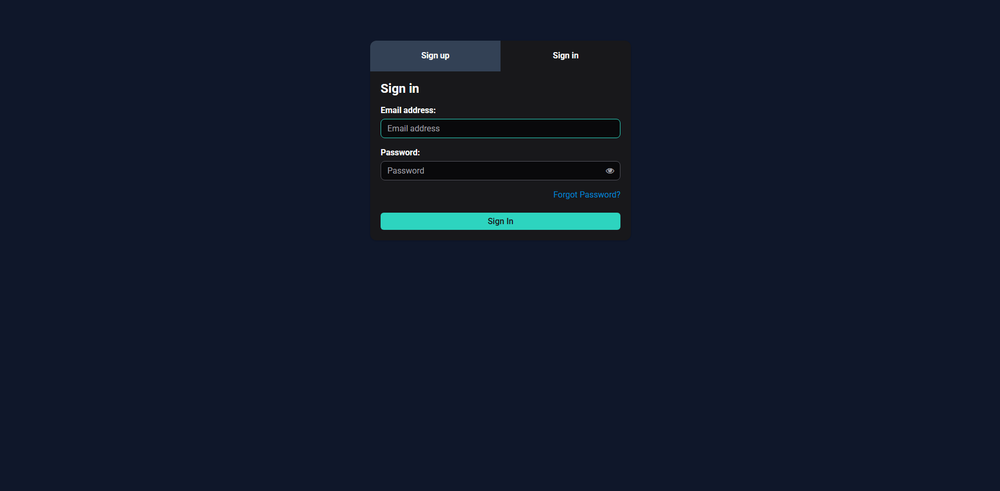

# Spring Video Chat

Screenshots of the app are included in the [**Screenshots**](#screenshots) section.

## Table of Contents

1. [**Notice**](#notice)
2. [**About the Project**](#about-the-project)
3. [**Used Technologies**](#used-technologies)
4. [**Tests**](#tests)
5. [**Screenshots**](#screenshots)
6. [**To-Do**](#to-do)

## Notice

This project is intended solely for local development and testing purposes. It has not been optimized or secured for deployment in a production environment. Using this project outside a controlled local setting may lead to unexpected issues or security risks.

## About the Project

Spring Chat is a real-time messaging and communication platform designed for interactive chat rooms. It enables users to send text messages, participate in video conferences, and manage chat channels efficiently.

The application is developed using Java Spring Boot for the backend and Angular for the frontend. For real-time text messaging, it leverages the WebSocket STOMP protocol, ensuring seamless and instantaneous communication. Video conferencing capabilities are powered by Janus WebRTC SFU, allowing high-quality and scalable media streaming.

Users have the ability to create their own chat channels, invite others, and define specific permissions for participants. These permissions include the ability to send and read messages, invite or remove users, and modify channel details. Additionally, users can send messages with embedded images and apply text formatting options such as bold, italic, and underline to enhance message presentation.

## Used Technologies

- [**Spring Boot**](https://spring.io/projects/spring-boot): The backend is built with Spring Boot, using Java 21. It handles the HTTP API and WebSocket communication via the STOMP protocol. Communication with Janus is done through a WebSocket client. The backend also interacts with MinIO for object storage via an S3 client, and Keycloak for user management through the Admin API.

- [**Angular**](https://angular.dev/): The frontend is developed using Angular. Custom services are used to interact with the Janus WebRTC library for video conferencing and the STOMP.js library for real-time messaging. These services are wrapped in RxJS primitives, providing a reactive approach for managing asynchronous events.

- [**RabbitMQ with STOMP plugin**](https://www.rabbitmq.com/docs/stomp): RabbitMQ is used as a messaging broker with the STOMP plugin, enabling message acknowledgments and the possibility of clustering, which is not yet implemented but could be used for scalability.

- [**Redis**](https://redis.io/): Redis is used to store information about active video room sessions and manage sorted sets for searching expired sessions. It provides quick access to session data for live video and chat functionality.

- [**Janus Gateway**](https://janus.conf.meetecho.com/): Janus Gateway is a WebRTC SFU used for video conferencing. It handles the routing of audio and video streams between users in the chat rooms.

- [**Keycloak**](https://www.keycloak.org/): Keycloak is used as the authentication and authorization server, managing user logins, roles, and permissions.

- [**PostgreSQL**](https://www.postgresql.org.pl/): PostgreSQL is used as the database for both the Spring Boot server and Keycloak, storing structured data like user information and chat history.

- [**MinIO**](https://min.io/): MinIO is used for object storage, specifically for storing images uploaded by users. It is S3-compatible, making it easy to replace with other S3-compliant storage services if needed.

## Project structure

**backend/main**: This directory contains the Spring Boot backend application. For local development, a `docker` folder is included with a `docker-compose` file that sets up all the necessary services required to run and test the application. For example, the `mailcatcher` service is included to catch SMTP messages from Keycloak. The `.env.example` file shows an example of the required Docker environment file, which includes the NAT address for Janus Gateway. This address should be set to the local IP address of the machine running the service. The `application-localsecrets.example.yml` file provides a template for secrets configuration, where all `\<change-me\>` placeholders need to be replaced with the corresponding service secrets. The local server should be run with the local profile.

**frontend/main**: This directory contains the Angular frontend application. For local development, the only requirement is to run `npm start` to launch the application.

**janus**: This directory contains the basic configuration for the Janus Gateway service. Additionally, the `janus_videoroom.c` file holds a modified version of the Janus VideoRoom plugin. This modification enforces user IDs, allowing the backend to differentiate between active sessions in the Janus Gateway. The enforcement is done by generating join tokens that include the user ID and a securely generated random token. The Dockerfile is a slightly modified version of the one provided by [Canyan.io](https://github.com/canyanio/janus-gateway-docker/tree/master), which allows the use of a specific tag from the Janus Gateway GitHub repository. It also enables only the plugins used by the application and configures certain arguments through the Docker Compose configuration files.

**keycloak**: This directory contains the Keycloak realms configuration and a custom template for the login page. The template ensures the login page's style matches the design of the frontend application.

**rabbitmq**: This directory contains the Dockerfile that enables the STOMP plugin and includes some required configuration files, such as setting a new password for the STOMP user.

## How to Run

To run the project locally, follow these steps:

1.  Environment Configuration:
    There is a .env.example file that shows the environment variables required for the application. You need to configure the following:

    `JANUS_NAT_1_1`: In the local environment, this should be set to the local IP address of the machine. This informs Janus that it is behind a NAT.

    `S3_ACCESS_KEY` and `S3_SECRET_KEY`: These should be set to the generated tokens from the MinIO Admin page, which you can access at http://localhost:9001.

    `KEYCLOAK_BACKEND_CLIENT_SECRET`: This should be set by generating a new secret for the springchat-backendmain client within the spring-chat realm in Keycloak.

    The rest of the environment variables marked as `\<change-me\>` can be set to randomly generated strings.

2.  Docker Compose:

    To run all required services (including backend, frontend, MinIO, RabbitMQ, Janus, and Keycloak), you can use the provided `docker-compose` setup provided in the main directory.

    ```
    docker-compose up
    ```

    The `localhost` service allows Keycloak service to run locally, allowing the backend to interact with Keycloak using localhost as the host for the token issuer configuration.

## Tests

While there is no 100% test coverage for the application, example tests are provided for specific use cases. Below is an overview of the tests for both the frontend and backend:

### Frontend Tests

1. **STOMP Service Testing:**
   The `stomp.service.spec.ts` file tests how the STOMP service in the frontend can be tested by mocking the communication with the STOMP protocol. This allows to verify the functionality of the service without requiring a live WebSocket connection.

   File: `frontend/main/src/app/core/stomp/service/stomp.service.spec.ts`

2. **Directive Testing**
   The `let.directive.spec.ts` file demonstrates how directives used in components can be tested. It provides examples of how to test the behavior of directives when they are applied to elements within a component.

   File: `frontend/main/src/app/shared/directive/let.directive.spec.ts`

3. **DOM Processor Testing:**
   The `message-dom-tag-processor.service.spec.ts` file tests the DOM processor service, which allows to stores messages not as HTML but as custom tags ensuring that XSS is highly unlikely.

   File: `frontend/main/src/app/channel/service/message-dom-tag-processor.service.spec.ts`

4. **Cache Service Testing:**
   The `cache.service.spec.ts` file tests the cache service that stores downloaded images of user icons in memory, preventing the need to download the same icon multiple times when displaying it for subsequent user icons.

   File: `frontend/main/src/app/shared/service/cache.service.spec.ts`

### Backend Tests

1. **STOMP Endpoint Testing:**

   There are end-to-end tests for interacting with the STOMP endpoints. These tests include a custom annotation, `@WithMockStompUser`, which is similar to Spring's `@WithMockUser`. It injects a user authentication principal before each test method and clears it afterward, simulating real user interactions with the STOMP protocol.

   File: `backend/main/src/test/groovy/pl/bronikowski/springchat/backendmain/channel/api/StompChannelControllerTest.groovy`

2. **User Creation in Keycloak:**
   The `UserProfileControllerTest.groovy` file tests the functionality of creating a user in Keycloak by using a mock response from the Keycloak package. This ensures that user creation and profile management work as expected.

   File: `backend/main/src/test/groovy/pl/bronikowski/springchat/backendmain/user/api/UserProfileControllerTest.groovy`

3. **Members API and Mocked S3 Client:**
   Tests for the members profile API are provided, including interactions with a mocked S3 client. This ensures that the backend correctly interacts with external storage services like S3, and validation is properly configured.

   File: `backend/main/src/test/groovy/pl/bronikowski/springchat/backendmain/member/api`

## Screenshots

### Main app view with enabled video chat



### Fullscreen version of video chat



### Channel settings



### Login page



### Registration page



## To-Do

- Write tests to achieve 100% coverage.
- Implement notifications for users about channel changes, including kicks, invitations, modifications to channels, and updates to user roles within a channel.
- Ensure that when a user is kicked, they are also removed from the video room.
- Ensure that when a user is kicked, their subscription to the channel is deleted from RabbitMQ.
